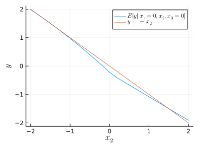
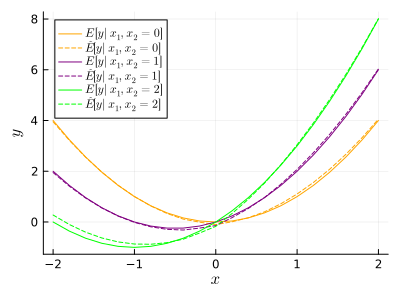

# Earth/MARS

This is a Julia implementation of a regression modeling procedure
that is similar to Jerome Friedman's 1991 Multivariate Adaptive
Regression Splines (MARS), which is also known as Earth for
trademark reasons.

The forward (basis-construction) phase used here should be identical
to the original MARS procedure.  The original MARS used backward
selection for model pruning, but this implementation uses the Lasso,
which was not invented yet at the time that MARS was conceived.

See the [examples](examples) folder for additional examples of using
Earth to build regression models.

## Usage

The following example has three explanatory variables (x1, x2, x3)
with an additive mean structure.  The additive contribution of x1 is
quadratic, the additive contribution of x2 is linear, and x3 does
not contribute to the mean structure.

````julia
using Earth, Plots, StableRNGs, LaTeXStrings, Statistics, Printf

rng = StableRNG(123)
n = 500
X = randn(rng, n, 3)
Ey = X[:, 1].^2 - X[:, 2]
y = Ey + randn(rng, n);
````

First we fit a model using Earth, constraining the "order" to 1,
which will be discussed further below.

````julia
cfg = EarthConfig(; maxorder=1)
md1 = fit(EarthModel, X, y; config=cfg, verbose=true)
````

````
     Coef    Std coef    Term
    -2.617       --      intercept
    -1.557      -0.787   intercept * h(v1 - 0.205)
     1.790       1.182   intercept * h(0.205 - v1)
    -0.444      -0.236   intercept * h(v2 - 0.171)
     0.622       0.403   intercept * h(0.171 - v2)
     1.193       1.074   intercept * h(v1 - -1.246)
     0.429       0.848   intercept * h(v1 - -1.246) * h(v1 - -0.199)
    -0.050      -0.042   intercept * h(v3 - -0.993)
    -0.120      -0.033   intercept * h(-0.993 - v3)
     0.018       0.037   intercept * h(v3 - -0.993) * h(v3 - -0.632)
     7.630       0.053   intercept * h(v3 - -0.993) * h(-0.632 - v3)
    -2.372      -0.020   intercept * h(0.171 - v2) * h(v2 - -0.175)
    -0.037      -0.045   intercept * h(0.171 - v2) * h(-0.175 - v2)

````

The representation of the model displayed above shows all of the
terms, and how each term is constructed as a product of hinges.  It
also gives the raw and standardized coefficients for each term.  The
standardized coefficient adjusts for the variance of the term and is
a better indicator of how much the term contributes to the model.

To visualize the fitted and true mean structures, we can consider
the fitted conditional mean of Y as a function of x1, holding x2
fixed at zero.  The true value of this function is $Ey = x_1^2$.

````julia
x = -2:0.2:2
X1 = [x zeros(length(x)) zeros(length(x))]
y1 = predict(md1, X1)

p = plot(x, y1, xlabel=L"$x_1$", ylabel=L"$y$", label=L"$E[y | x_1, x_2=0]$",
         size=(400, 300))
p = plot!(p, x, x.^2, label=L"$y = x_1^2$")
Plots.savefig(p, "../assets/readme1.svg")
````

````
"/home/kshedden/Projects/julia/Earth.jl/assets/readme1.svg"
````


We can also consider the fitted conditional mean of y as a function
of x2, holding x1 fixed at zero.  The true value of this function is
$Ey = -x_2$.

````julia
x = -2:0.2:2
X2 = [zeros(length(x)) x zeros(length(x))]
y2 = predict(md1, X2)

p = plot(x, y2, label=L"$E[y | x_1=0, x_2, x_3=0]$", xlabel=L"$x_2$", ylabel=L"$y$",
         size=(400, 300))
p = plot!(p, x, -x, label=L"$y = -x_2$")
Plots.savefig(p, "../assets/readme2.svg")
````

````
"/home/kshedden/Projects/julia/Earth.jl/assets/readme2.svg"
````



## Specifying the model structure

There are several ways to control the structure of the model fit by
Earth.  Above we set `maxorder=1`, which produces an additive fit,
meaning that each term in the fitted mean structure involves only
one of the original variables.  By default, the maximum "degree" of
any term in the fitted model is two, meaning that each term can
include up to two hinges involving the same variable.  The
constraints `maxorder=1` and `maxdegree=2` allow Earth to exactly
represent the true mean structure in this example.

Next we refit the model using Earth, but allowing up to two-way
interactions (even though no two-way interactions are present).  In
spite of the added (but unneeded) flexibility, we still do a good
job capturing the mean structure.

````julia
cfg = EarthConfig(; maxorder=2, maxdegree=2)
md2 = fit(EarthModel, X, y; config=cfg)

x = -2:0.2:2
X1 = [x zeros(length(x)) zeros(length(x))]
y1 = predict(md2, X1)
p = plot(x, y1, xlabel=L"$x_1$", ylabel=L"$y$", label=L"$E[y | x_1, x_2=0, x_3=0]$",
         size=(400, 300))
p = plot!(p, x, x.^2, label=L"$y = x_1^2$")
Plots.savefig(p, "../assets/readme3.svg")
````

````
"/home/kshedden/Projects/julia/Earth.jl/assets/readme3.svg"
````

Perhaps we may wish to specify a model in which each variable can
contribute main effects, but only the first two variables may have
an interaction.  This can be accomplished as follows.

````julia
constraints = Set([[true, false, false], [false, true, false], [false, false, true], [true, true, false]])
cfg = EarthConfig(; maxorder=2, maxdegree=2, constraints=constraints)
md3 = fit(EarthModel, X, y; config=cfg)
````

````
     Coef    Std coef    Term
    -2.656       --      intercept
    -1.491      -0.754   intercept * h(v1 - 0.205)
     1.769       1.168   intercept * h(0.205 - v1)
    -0.371      -0.197   intercept * h(v2 - 0.171)
     0.618       0.401   intercept * h(0.171 - v2)
     1.156       1.040   intercept * h(v1 - -1.246)
     0.451       0.893   intercept * h(v1 - -1.246) * h(v1 - -0.199)
     0.000       0.000   intercept * h(v1 - 0.205) * h(v2 - -0.746)
    -0.405      -0.076   intercept * h(v1 - 0.205) * h(-0.746 - v2)
    -0.054      -0.048   intercept * h(v1 - 0.205) * h(v2 - -0.746) * h(v1 - 0.784)
    -0.734      -0.025   intercept * h(v1 - 0.205) * h(v2 - -0.746) * h(0.784 - v1)
    -0.431      -0.023   intercept * h(v1 - 0.205) * h(v2 - -0.746) * h(0.784 - v1) * h(v2 - 0.283)
    11.235       0.033   intercept * h(v1 - 0.205) * h(v2 - -0.746) * h(0.784 - v1) * h(0.283 - v2)
    -0.084      -0.023   intercept * h(-0.993 - v3)
     8.663       0.060   intercept * h(v3 - -0.993) * h(-0.632 - v3)
   -68.573      -0.029   intercept * h(v1 - 0.205) * h(v2 - -0.746) * h(v1 - 0.784) * h(-0.613 - v2)

````


## Assessing goodness of fit

First we generate a new dataset using a population structure that is
not additive.

````julia
rng = StableRNG(123)
n = 1000
X = randn(rng, n, 3)
Ey = X[:, 1].^2 + X[:, 1] .* X[:, 2]
y = Ey  + randn(rng, n)

md4 = fit(EarthModel, X, y)
````

````
     Coef    Std coef    Term
    -0.522       --      intercept
    -0.389      -0.237   intercept * h(0.052 - v1)
     0.485       0.376   intercept * h(v1 - 0.052) * h(v2 - -0.799)
    -0.481      -0.104   intercept * h(v1 - 0.052) * h(-0.799 - v2)
    -0.398      -0.071   intercept * h(0.052 - v1) * h(v2 - 1.253)
     0.478       0.464   intercept * h(0.052 - v1) * h(1.253 - v2)
     8.676       0.086   intercept * h(0.052 - v1) * h(v1 - -0.334)
     0.470       0.494   intercept * h(0.052 - v1) * h(-0.334 - v1)
     0.371       0.321   intercept * h(v1 - 0.052) * h(v1 - 0.467)
    -5.571      -0.066   intercept * h(v1 - 0.052) * h(0.467 - v1)
   -70.206      -0.042   intercept * h(0.052 - v1) * h(v1 - -0.334) * h(v3 - 1.667)
    -3.913      -0.073   intercept * h(0.052 - v1) * h(v1 - -0.334) * h(1.667 - v3)
    11.846       0.059   intercept * h(v1 - 0.052) * h(v2 - -0.799) * h(0.318 - v1)
     0.042       0.054   intercept * h(v1 - 0.052) * h(v1 - 0.467) * h(v3 - -1.295)
    -0.305      -0.029   intercept * h(v1 - 0.052) * h(v1 - 0.467) * h(-1.295 - v3)
    -6.441      -0.034   intercept * h(0.052 - v1) * h(v1 - -0.334) * h(-0.483 - v2)
  6597.944       0.043   intercept * h(0.052 - v1) * h(v1 - -0.334) * h(v2 - -0.483) * h(-0.339 - v2)

````

One way to assess how well we have fit the mean structure is by
considering the mean squared error (MSE). If we have closely
captured the mean structure, then the MSE should be close to the
residual variance, which is 1.

````julia
res = residuals(md4)
mean(res.^2)
````

````
0.9232496017082579
````

Below we plot three conditional mean functions of the form E[y |
x_1, x_2=f, x_3=0] for fixed values of f=0, 1, 2.

````julia
function make_plot(md)
    x = -2:0.2:2
    p = nothing
    yy = []
    cols = ["orange", "purple", "lime"]
    for (j,f) in enumerate([0, 1, 2])
        X1 = [x f*ones(length(x)) zeros(length(x))]
        yp = predict(md, X1)
        p = if j == 1
            plot(x, x.^2 + f*x, xlabel=L"$x$", ylabel=L"$y$", label=L"$E[y | x_1, x_2=%$f]$",
                 color=cols[j], size=(400, 300))
        else
            plot!(p, x, x.^2 + f*x, color=cols[j], label=L"$E[y | x_1, x_2=%$f]$")
        end
        plot!(p, x, yp, color=cols[j], ls=:dash, label=L"$\hat{E}[y | x_1, x_2=%$f]$")
    end
    Plots.savefig(p, "../assets/readme4.svg")
end

make_plot(md4)
````

````
"/home/kshedden/Projects/julia/Earth.jl/assets/readme4.svg"
````



Below we plot the generalized r-squared statistic against the number
of model terms (the degrees of freedom in the model) during the
forward phase of model construction.  The true (population)
r-squared value is also plotted.

````julia
p = plot(md4.nterms, gr2(md4), label=L"Estimated $r^2$", size=(400, 300),
         xlabel="Number of terms", ylabel=L"$r^2$")
p = plot!(p, md4.nterms, cor(Ey, y)^2*ones(length(md4.nterms)), label=L"True $r^2$")
Plots.savefig(p, "../assets/readme5.svg")
````

````
"/home/kshedden/Projects/julia/Earth.jl/assets/readme5.svg"
````


## References

[1] Multivariate Adaptive Regression Splines, Jerome H. Friedman.
The Annals of Statistics, Vol. 19, No. 1. (Mar., 1991), pp. 1-67.

---

*This page was generated using [Literate.jl](https://github.com/fredrikekre/Literate.jl).*

