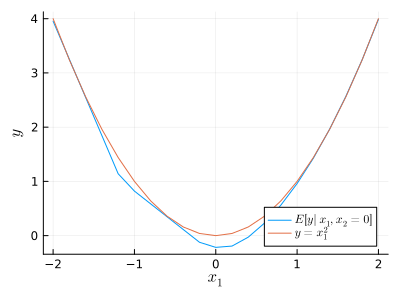

# Earth/MARS

This is a Julia implementation of a regression modeling procedure that
is similar to Jerome Friedman's 1991 Multivariate Adaptive Regression
Splines (MARS), which is also known as Earth for trademark reasons.

The original MARS used backward selection for model pruning, but this
implementation uses the Lasso, which was not invented yet at the time
that MARS was conceived.

## Usage

The following example fits an additive model using two explanatory
variables.  The additive contribution of X1 is quadratic and the
additive contribution of X2 is linear.

````julia
using Earth, Plots, StableRNGs, LaTeXStrings, Statistics, Printf

rng = StableRNG(123)
n = 500
X = randn(rng, n, 2)
y = X[:, 1].^2 - X[:, 2] + randn(rng, n)
m = fit(EarthModel, X, y; maxorder=1)

# Estimate E[y | x1, x2=0]
x = -2:0.2:2
X1 = [x zeros(length(x))]
y1 = predict(m, X1)

# Estimate E[y | x1=0, x2]
x = -2:0.2:2
X2 = [zeros(length(x)) x]
y2 = predict(m, X2)

p = plot(x, y1, label=L"$E[y | x_1, x_2=0]$", size=[300, 300])
p = plot!(p, x, y2, label=L"$E[y | x_1=0, x_2]$")
Plots.savefig(p, "./assets/readme1.svg")
````



The following example has a nonlinear and non-additive
mean structure. The standard deviation of the residuals
is very close to the standard deviation of the residuals,
which is 1.

````julia
rng = StableRNG(123)
n = 500
X = randn(rng, n, 2)
y = X[:, 1].^3 + X[:, 1] .* X[:, 2] + randn(rng, n)
m = fit(EarthModel, X, y; maxorder=1)

yhat = predict(m)
res = residuals(m)

p = plot(yhat, res, size=[300, 300], xlabel="Fitted values",
         ylabel=@sprintf("Residuals (SD=%.2f)", std(res)))
Plots.savefig(p, "./assets/readme2.svg")
````


## References

[1] Multivariate Adaptive Regression Splines, Jerome H. Friedman.
The Annals of Statistics, Vol. 19, No. 1. (Mar., 1991), pp. 1-67.

---

*This page was generated using [Literate.jl](https://github.com/fredrikekre/Literate.jl).*

