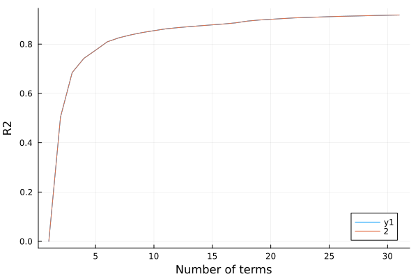

# Ames housing data

````julia
using RCall
using DataFrames
using Earth

using Plots

R"
install.packages('AmesHousing', repos='https://cloud.r-project.org')
library(AmesHousing)
D = make_ames()
"

ames = @rget D;
````

````
┌ Warning: RCall.jl: Installing package into ‘/home/kshedden/R/x86_64-pc-linux-gnu-library/4.3’
│ (as ‘lib’ is unspecified)
│ Warning: unable to access index for repository https://cloud.r-project.org/src/contrib:
│   cannot open URL 'https://cloud.r-project.org/src/contrib/PACKAGES'
│ Warning: package ‘AmesHousing’ is not available for this version of R
│ 
│ A version of this package for your version of R might be available elsewhere,
│ see the ideas at
│ https://cran.r-project.org/doc/manuals/r-patched/R-admin.html#Installing-packages
└ @ RCall ~/.julia/packages/RCall/gOwEW/src/io.jl:172

````

The response variable is the sale price of each property.

````julia
y = Float64.(D[:, :Sale_Price]) / 10000;
````

Everything else in the dataframe is a covariate

````julia
X = select(D, Not(:Sale_Price));
names(X)
````

````
80-element Vector{String}:
 "MS_SubClass"
 "MS_Zoning"
 "Lot_Frontage"
 "Lot_Area"
 "Street"
 "Alley"
 "Lot_Shape"
 "Land_Contour"
 "Utilities"
 "Lot_Config"
 "Land_Slope"
 "Neighborhood"
 "Condition_1"
 "Condition_2"
 "Bldg_Type"
 "House_Style"
 "Overall_Qual"
 "Overall_Cond"
 "Year_Built"
 "Year_Remod_Add"
 "Roof_Style"
 "Roof_Matl"
 "Exterior_1st"
 "Exterior_2nd"
 "Mas_Vnr_Type"
 "Mas_Vnr_Area"
 "Exter_Qual"
 "Exter_Cond"
 "Foundation"
 "Bsmt_Qual"
 "Bsmt_Cond"
 "Bsmt_Exposure"
 "BsmtFin_Type_1"
 "BsmtFin_SF_1"
 "BsmtFin_Type_2"
 "BsmtFin_SF_2"
 "Bsmt_Unf_SF"
 "Total_Bsmt_SF"
 "Heating"
 "Heating_QC"
 "Central_Air"
 "Electrical"
 "First_Flr_SF"
 "Second_Flr_SF"
 "Low_Qual_Fin_SF"
 "Gr_Liv_Area"
 "Bsmt_Full_Bath"
 "Bsmt_Half_Bath"
 "Full_Bath"
 "Half_Bath"
 "Bedroom_AbvGr"
 "Kitchen_AbvGr"
 "Kitchen_Qual"
 "TotRms_AbvGrd"
 "Functional"
 "Fireplaces"
 "Fireplace_Qu"
 "Garage_Type"
 "Garage_Finish"
 "Garage_Cars"
 "Garage_Area"
 "Garage_Qual"
 "Garage_Cond"
 "Paved_Drive"
 "Wood_Deck_SF"
 "Open_Porch_SF"
 "Enclosed_Porch"
 "Three_season_porch"
 "Screen_Porch"
 "Pool_Area"
 "Pool_QC"
 "Fence"
 "Misc_Feature"
 "Misc_Val"
 "Mo_Sold"
 "Year_Sold"
 "Sale_Type"
 "Sale_Condition"
 "Longitude"
 "Latitude"
````

Fit a model and inspect its structure

````julia
cfg = EarthConfig(; maxit=40, maxorder=1)
m = fit(EarthModel, X, y; config=cfg, verbosity=1)
````

````
     Coef    Std coef    Term
     1.814       --      intercept
     1.006       0.267   intercept * h(Gr_Liv_Area - 1.876)
    -0.316      -0.281   intercept * h(1.876 - Gr_Liv_Area)
     1.229       0.053   intercept * h(Year_Built - 1.046)
    -0.166      -0.163   intercept * h(1.046 - Year_Built)
    -0.059      -0.059   intercept * h(3.218 - Bsmt_Qual::Excellent)
     1.599       0.489   intercept * h(Total_Bsmt_SF - 1.592)
    -0.168      -0.149   intercept * h(1.592 - Total_Bsmt_SF)
    -0.189      -0.612   intercept * h(Total_Bsmt_SF - 1.592) * h(Total_Bsmt_SF - -2.384)
    -0.111      -0.082   intercept * h(Bsmt_Unf_SF - -0.144)
     0.074       0.029   intercept * h(-0.144 - Bsmt_Unf_SF)
    -0.059      -0.059   intercept * h(Kitchen_AbvGr - -0.207)
     0.119       0.057   intercept * h(Garage_Cars - 0.307)
    -0.050      -0.038   intercept * h(0.307 - Garage_Cars)
     0.127       0.091   intercept * h(Year_Remod_Add - -0.636)
     0.055       0.020   intercept * h(-0.636 - Year_Remod_Add)
     0.051       0.051   intercept * h(Kitchen_Qual::Excellent - -0.274)
    -0.052      -0.052   intercept * h(3.706 - Fireplaces)
     0.048       0.048   intercept * h(Functional::Typ - -3.675)
    -0.045      -0.045   intercept * h(3.052 - Bsmt_Exposure::Gd)
    -0.061      -0.061   intercept * h(Condition_2::PosN - -0.037)
     0.148       0.148   intercept * h(Overall_Qual::Very_Excellent - -0.103)
     0.158       0.158   intercept * h(Overall_Qual::Excellent - -0.195)
     0.132       0.132   intercept * h(Overall_Qual::Very_Good - -0.368)
     0.048       0.046   intercept * h(Lot_Area - -0.508)
    -0.440      -0.054   intercept * h(-0.508 - Lot_Area)
     0.066       0.066   intercept * h(Overall_Qual::Good - -0.509)
     0.107       0.107   intercept * h(Roof_Matl::ClyTile - -0.018)
    -0.053      -0.053   intercept * h(5.239 - Neighborhood::Crawford)
     0.040       0.040   intercept * h(3.798 - Sale_Condition::Abnorml)
    -0.051      -0.051   intercept * h(6.346 - Neighborhood::Northridge)
    -0.040      -0.040   intercept * h(7.513 - Neighborhood::Stone_Brook)
    -0.048      -0.048   intercept * h(Overall_Cond::Fair - -0.132)
     0.035       0.035   intercept * h(Neighborhood::Green_Hills - -0.026)
    -0.053      -0.053   intercept * h(Overall_Cond::Average - -1.139)
     0.039       0.039   intercept * h(5.292 - Overall_Cond::Below_Average)
    -0.107      -0.184   intercept * h(Gr_Liv_Area - 1.876) * h(Gr_Liv_Area - -0.706)
     0.023       0.009   intercept * h(Screen_Porch - 2.496)
    -0.036      -0.027   intercept * h(2.496 - Screen_Porch)

````

Next we generate a plot showing the generalized R2 as we increase the number of terms

````julia
r2 = gr2(m)
p = plot(m.nterms, r2, xlabel="Number of terms", ylabel="R2")
Plots.savefig(p, "./assets/ames1.svg");
````



---

*This page was generated using [Literate.jl](https://github.com/fredrikekre/Literate.jl).*

