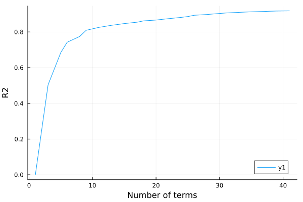

# Ames housing data

````julia
using RCall
using DataFrames
using Earth

using Plots

R"
install.packages('AmesHousing', repos='https://cloud.r-project.org')
library(AmesHousing)
D = make_ames()
"

ames = @rget D;
````

````
┌ Warning: RCall.jl: Installing package into ‘/home/kshedden/R/x86_64-pc-linux-gnu-library/4.3’
│ (as ‘lib’ is unspecified)
│ Warning: unable to access index for repository https://cloud.r-project.org/src/contrib:
│   cannot open URL 'https://cloud.r-project.org/src/contrib/PACKAGES'
│ Warning: package ‘AmesHousing’ is not available for this version of R
│ 
│ A version of this package for your version of R might be available elsewhere,
│ see the ideas at
│ https://cran.r-project.org/doc/manuals/r-patched/R-admin.html#Installing-packages
└ @ RCall ~/.julia/packages/RCall/gOwEW/src/io.jl:172

````

The response variable is the sale price of each property.

````julia
y = Float64.(D[:, :Sale_Price]) / 10000;
````

Everything else in the dataframe is a covariate

````julia
X = select(D, Not(:Sale_Price));
names(X)
````

````
80-element Vector{String}:
 "MS_SubClass"
 "MS_Zoning"
 "Lot_Frontage"
 "Lot_Area"
 "Street"
 "Alley"
 "Lot_Shape"
 "Land_Contour"
 "Utilities"
 "Lot_Config"
 "Land_Slope"
 "Neighborhood"
 "Condition_1"
 "Condition_2"
 "Bldg_Type"
 "House_Style"
 "Overall_Qual"
 "Overall_Cond"
 "Year_Built"
 "Year_Remod_Add"
 "Roof_Style"
 "Roof_Matl"
 "Exterior_1st"
 "Exterior_2nd"
 "Mas_Vnr_Type"
 "Mas_Vnr_Area"
 "Exter_Qual"
 "Exter_Cond"
 "Foundation"
 "Bsmt_Qual"
 "Bsmt_Cond"
 "Bsmt_Exposure"
 "BsmtFin_Type_1"
 "BsmtFin_SF_1"
 "BsmtFin_Type_2"
 "BsmtFin_SF_2"
 "Bsmt_Unf_SF"
 "Total_Bsmt_SF"
 "Heating"
 "Heating_QC"
 "Central_Air"
 "Electrical"
 "First_Flr_SF"
 "Second_Flr_SF"
 "Low_Qual_Fin_SF"
 "Gr_Liv_Area"
 "Bsmt_Full_Bath"
 "Bsmt_Half_Bath"
 "Full_Bath"
 "Half_Bath"
 "Bedroom_AbvGr"
 "Kitchen_AbvGr"
 "Kitchen_Qual"
 "TotRms_AbvGrd"
 "Functional"
 "Fireplaces"
 "Fireplace_Qu"
 "Garage_Type"
 "Garage_Finish"
 "Garage_Cars"
 "Garage_Area"
 "Garage_Qual"
 "Garage_Cond"
 "Paved_Drive"
 "Wood_Deck_SF"
 "Open_Porch_SF"
 "Enclosed_Porch"
 "Three_season_porch"
 "Screen_Porch"
 "Pool_Area"
 "Pool_QC"
 "Fence"
 "Misc_Feature"
 "Misc_Val"
 "Mo_Sold"
 "Year_Sold"
 "Sale_Type"
 "Sale_Condition"
 "Longitude"
 "Latitude"
````

Fit a model and inspect its structure

````julia
cfg = EarthConfig(; maxit=40, maxorder=1)
m = fit(EarthModel, X, y; config=cfg, verbose=true)
````

````
     Coef    Std coef    Term
     7.130       --      intercept
     0.002       0.313   intercept * h(Gr_Liv_Area - 2448.000)
    -0.001      -0.281   intercept * h(2448.000 - Gr_Liv_Area)
     0.046       0.060   intercept * h(Year_Built - 2003.000)
    -0.005      -0.160   intercept * h(2003.000 - Year_Built)
    -0.205      -0.058   intercept * h(1.000 - Bsmt_Qual::Excellent)
     0.004       0.486   intercept * h(Total_Bsmt_SF - 1753.000)
    -0.000      -0.149   intercept * h(1753.000 - Total_Bsmt_SF)
    -0.000      -0.608   intercept * h(Total_Bsmt_SF - 1753.000) * h(Total_Bsmt_SF - 0.000)
    -0.000      -0.083   intercept * h(Bsmt_Unf_SF - 496.000)
     0.000       0.030   intercept * h(496.000 - Bsmt_Unf_SF)
    -0.277      -0.059   intercept * h(Kitchen_AbvGr - 1.000)
     0.154       0.056   intercept * h(Garage_Cars - 2.000)
    -0.065      -0.038   intercept * h(2.000 - Garage_Cars)
     0.006       0.088   intercept * h(Year_Remod_Add - 1971.000)
     0.002       0.018   intercept * h(1971.000 - Year_Remod_Add)
     0.196       0.050   intercept * h(Kitchen_Qual::Excellent - 0.000)
    -0.082      -0.053   intercept * h(3.000 - Fireplaces)
     0.189       0.048   intercept * h(Functional::Typ - 0.000)
     0.152       0.045   intercept * h(Bsmt_Exposure::Gd - 0.000)
    -1.656      -0.061   intercept * h(Condition_2::PosN - 0.000)
     1.437       0.147   intercept * h(Overall_Qual::Very_Excellent - 0.000)
     0.839       0.157   intercept * h(Overall_Qual::Excellent - 0.000)
     0.403       0.131   intercept * h(Overall_Qual::Very_Good - 0.000)
     0.000       0.046   intercept * h(Lot_Area - 6141.842)
    -0.000      -0.055   intercept * h(6141.842 - Lot_Area)
     0.161       0.065   intercept * h(Overall_Qual::Good - 0.000)
    -5.654      -0.104   intercept * h(1.000 - Roof_Matl::ClyTile)
     0.282       0.052   intercept * h(Neighborhood::Crawford - 0.000)
    -0.164      -0.040   intercept * h(Sale_Condition::Abnorml - 0.000)
    -0.338      -0.052   intercept * h(1.000 - Neighborhood::Northridge)
     0.306       0.040   intercept * h(Neighborhood::Stone_Brook - 0.000)
    -0.372      -0.048   intercept * h(Overall_Cond::Fair - 0.000)
     1.338       0.035   intercept * h(Neighborhood::Green_Hills - 0.000)
    -0.105      -0.052   intercept * h(Overall_Cond::Average - 0.000)
    -0.215      -0.039   intercept * h(Overall_Cond::Below_Average - 0.000)
    -0.000      -0.227   intercept * h(Gr_Liv_Area - 2448.000) * h(Gr_Liv_Area - 334.000)
    -0.001      -0.032   intercept * h(156.000 - Screen_Porch)

````

Next we generate a plot showing the generalized R2 as we increase the number of terms

````julia
r2 = gr2(m)
p = plot(1:length(r2), r2, xlabel="Number of terms", ylabel="R2")
plot!(p, 1:length(r2), r2, label="2")
Plots.savefig(p, "./assets/ames1.svg");
````



---

*This page was generated using [Literate.jl](https://github.com/fredrikekre/Literate.jl).*

