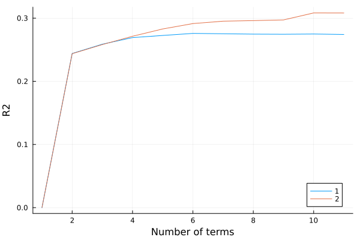

```@meta
EditURL = "nhanes.jl"
```

# National Health and Nutrition Examination Survey (NHANES)

Here we demonstrate EARTH by building regression models
to study the variation in systolic blood pressure (SBP)
in terms of age, BMI, sex, and ethnicity.

````julia
using CategoricalArrays
using CSV
using DataFrames
using Downloads
using Earth
using Plots
using ReadStatTables

dfile = "assets/nhanes2017.csv.gz"
````

````
"assets/nhanes2017.csv.gz"
````

Download and merge the data sets

````julia
function get_data()

    mkpath("assets")
    y = 2017
    letter = "ABCDEFGHIJ"[1 + div(y - 1999, 2)]

    dx = []
    for f in ["DEMO", "BMX", "BPX"]
        g = "$(f)_$(letter).XPT"
        s = "https://wwwn.cdc.gov/Nchs/Nhanes/2017-2018/$(g)"
        h = joinpath("assets", g)
        Downloads.download(s, h)
        da = readstat(h) |> DataFrame
        push!(dx, da)
    end

    demog = dx[1][:, [:SEQN, :RIAGENDR, :RIDAGEYR, :RIDRETH1]]
    bmx = dx[2][:, [:SEQN, :BMXBMI]]
    sbp = dx[3][:, [:SEQN, :BPXSY1]]

    da = leftjoin(demog, bmx, on=:SEQN)
    da = leftjoin(da, sbp, on=:SEQN)

    da = da[completecases(da), :]
    da = disallowmissing(da)
    da[!, :RIAGENDR] = replace(da[:, :RIAGENDR], 1=>"Male", 2=>"Female") .|> String
    da[!, :RIDRETH1] = replace(da[:, :RIDRETH1], 1=>"MA", 2=>"OH", 3=>"NHW", 4=>"NHB", 5=>"OR") .|> String
    da = filter(r->r.RIDAGEYR >= 18, da)

    CSV.write(dfile, da; compress=true)
end;
````

Get the data only if it is not already present

````julia
isfile(dfile) || get_data()
da = open(dfile) do io
    CSV.read(io, DataFrame)
end;
````

To use categorical variables in Earth they must be
explicitly typed as CategoricalArray.

````julia
da[!, :RIDRETH1] = CategoricalArray(da[:, :RIDRETH1]);
da[!, :RIAGENDR] = CategoricalArray(da[:, :RIAGENDR]);
````

The response variable

````julia
y = da[:, :BPXSY1];
````

The covariates

````julia
X = (RIDAGEYR=da[:, :RIDAGEYR], BMXBMI=da[:, :BMXBMI], RIAGENDR=da[:, :RIAGENDR], RIDRETH1=da[:, :RIDRETH1]);
````

Fit an additive model, limiting the order of each
term to 1.

````julia
m1 = fit(EarthModel, X, y; verbose=true, maxorder=1)
````

````
intercept
intercept & RIDAGEYR > 34.000
intercept & RIDAGEYR < 34.000
intercept & BMXBMI > 33.042
intercept & BMXBMI < 33.042
intercept & RIDAGEYR > 34.000 & RIDRETH1::NHW > 0.000
intercept & BMXBMI < 33.042 & RIDAGEYR > 41.000
intercept & BMXBMI < 33.042 & RIDAGEYR < 41.000
intercept & RIDRETH1::NHB > 0.000
intercept & RIDRETH1::NHB > 0.000 & RIDAGEYR > 55.474
intercept & RIDRETH1::NHB > 0.000 & RIDAGEYR < 55.474
intercept & RIDAGEYR > 34.000 & RIAGENDR::Female > 0.000
intercept & RIAGENDR::Female < 1.000
intercept & RIDRETH1::NHB > 0.000 & RIDAGEYR > 55.474 & RIDAGEYR > 59.000
intercept & RIDRETH1::NHB > 0.000 & RIDAGEYR > 55.474 & RIDAGEYR < 59.000

````

Allow nonlinear main effects and two-way interactions.

````julia
m2 = fit(EarthModel, X, y; verbose=true, maxorder=2)
````

````
intercept
intercept & RIDAGEYR > 34.000
intercept & RIDAGEYR < 34.000
intercept & BMXBMI > 33.042
intercept & BMXBMI < 33.042
intercept & RIDAGEYR > 34.000 & RIDRETH1::NHW > 0.000
intercept & BMXBMI < 33.042 & RIDAGEYR > 41.000
intercept & BMXBMI < 33.042 & RIDAGEYR < 41.000
intercept & RIDRETH1::NHB > 0.000
intercept & RIDRETH1::NHB > 0.000 & RIDAGEYR > 55.474
intercept & RIDRETH1::NHB > 0.000 & RIDAGEYR < 55.474
intercept & RIDAGEYR > 34.000 & RIAGENDR::Female > 0.000
intercept & RIAGENDR::Female < 1.000
intercept & RIDRETH1::NHB > 0.000 & RIDAGEYR > 55.474 & RIDAGEYR > 59.000
intercept & RIDRETH1::NHB > 0.000 & RIDAGEYR > 55.474 & RIDAGEYR < 59.000

````

The function below generates the fitted mean blood pressure
at fixed levels of sex, BMI, and race.

````julia
function sbp_by_age(m; sex="Female", bmi=25, eth="NHB")
    dp = da[1:100, [:RIDAGEYR, :BMXBMI, :RIAGENDR, :RIDRETH1]]
    dp[:, :RIDAGEYR] = range(18, 80, 100)
    dp[:, :BMXBMI] .= bmi
    dp[:, :RIAGENDR] .= sex
    dp[:, :RIDRETH1] .= eth
    yh = predict(m, dp)
    return dp[:, :RIDAGEYR], yh
end
````

````
sbp_by_age (generic function with 1 method)
````

The plot below shows the estimated conditional mean blood
pressure values for non-hispanic black females, at three
levels of BMI.

````julia
age, sbp = sbp_by_age(m1; bmi=25)
p = plot(age, sbp, xlabel="Age", ylabel="SBP", label="BMI=25")
age, sbp = sbp_by_age(m1; bmi=30)
plot!(p, age, sbp, label="BMI=30")
age, sbp = sbp_by_age(m1; bmi=35)
plot!(p, age, sbp, label="BMI=35")
Plots.savefig(p, "./assets/nhanes1.svg")
````

````
"/home/kshedden/Projects/julia/Earth.jl/examples/assets/nhanes1.svg"
````



---

*This page was generated using [Literate.jl](https://github.com/fredrikekre/Literate.jl).*

