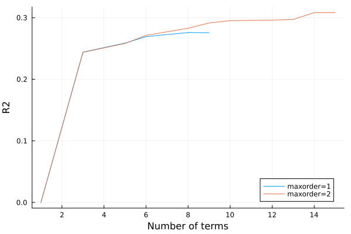
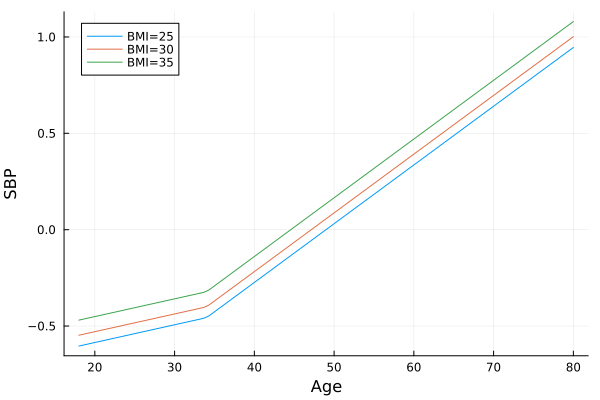

```@meta
EditURL = "nhanes.jl"
```

# National Health and Nutrition Examination Survey (NHANES)

Here we demonstrate EARTH by building regression models
to study the variation in systolic blood pressure (SBP)
in terms of age, BMI, sex, and ethnicity.

See the [NHANES website](https://wwwn.cdc.gov/nchs/nhanes) for more
information about these data.

````julia
using CategoricalArrays
using CSV
using DataFrames
using Downloads
using Earth
using Plots
using ReadStatTables

dfile = "assets/nhanes2017.csv.gz";
````

The function below downloads and merges the data sets.

````julia
function get_data()

    mkpath("assets")
    y = 2017
    letter = "ABCDEFGHIJ"[1 + div(y - 1999, 2)]

    dx = []
    for f in ["DEMO", "BMX", "BPX"]
        g = "$(f)_$(letter).XPT"
        s = "https://wwwn.cdc.gov/Nchs/Nhanes/2017-2018/$(g)"
        h = joinpath("assets", g)
        Downloads.download(s, h)
        da = readstat(h) |> DataFrame
        push!(dx, da)
    end

    demog = dx[1][:, [:SEQN, :RIAGENDR, :RIDAGEYR, :RIDRETH1]]
    bmx = dx[2][:, [:SEQN, :BMXBMI]]
    sbp = dx[3][:, [:SEQN, :BPXSY1]]

    da = leftjoin(demog, bmx, on=:SEQN)
    da = leftjoin(da, sbp, on=:SEQN)

    da = da[completecases(da), :]
    da = disallowmissing(da)
    da[!, :RIAGENDR] = replace(da[:, :RIAGENDR], 1=>"Male", 2=>"Female") .|> String
    da[!, :RIDRETH1] = replace(da[:, :RIDRETH1], 1=>"MA", 2=>"OH", 3=>"NHW", 4=>"NHB", 5=>"OR") .|> String
    da = filter(r->r.RIDAGEYR >= 18, da)

    CSV.write(dfile, da; compress=true)
end;
````

Download the data only if it is not already present

````julia
isfile(dfile) || get_data();
````

Read the data into a data frame.

````julia
da = open(dfile) do io
    CSV.read(io, DataFrame)
end;
````

To use categorical variables in Earth they must be
explicitly typed as CategoricalArray.

````julia
da[!, :RIDRETH1] = CategoricalArray(da[:, :RIDRETH1]);
da[!, :RIAGENDR] = CategoricalArray(da[:, :RIAGENDR]);
````

Define the response variable as a float vector:

````julia
y = da[:, :BPXSY1];
````

Construct the covariates as a named tuple:

````julia
X = (RIDAGEYR=da[:, :RIDAGEYR], BMXBMI=da[:, :BMXBMI], RIAGENDR=da[:, :RIAGENDR], RIDRETH1=da[:, :RIDRETH1]);
````

Fit an additive model, limiting the order and degree of each
term to 1.  Note that each term only involves a single covariate.

````julia
m1 = fit(EarthModel, X, y; verbose=true, maxorder=1, maxdegree=1)
````

````
   129.001  intercept
     0.266  intercept * h(34.000 - RIDAGEYR)
     0.312  intercept * h(BMXBMI - 33.042)
     3.581  intercept * h(RIDRETH1::NHB - 0.000)
    -3.058  intercept * h(RIDRETH1::NHW - 0.000)
    -2.508  intercept * h(RIAGENDR::Female - 0.000)
     0.956  intercept * h(RIDAGEYR - 75.000)
    -0.501  intercept * h(59.000 - RIDAGEYR)
     0.306  intercept * h(RIDAGEYR - 49.000)
     0.084  intercept * h(RIDAGEYR - 61.000)
     0.156  intercept * h(BMXBMI - 23.900)
    -0.461  intercept * h(23.900 - BMXBMI)

````

Fit another model that allows nonlinear main effects and two-way
interactions.

````julia
m2 = fit(EarthModel, X, y; verbose=true, maxorder=2, maxdegree=1)
````

````
   114.143  intercept
     0.314  intercept * h(RIDAGEYR - 34.000)
    -0.351  intercept * h(34.000 - RIDAGEYR)
     0.371  intercept * h(BMXBMI - 33.042)
    -0.891  intercept * h(33.042 - BMXBMI)
    -0.161  intercept * h(RIDAGEYR - 34.000) * h(RIDRETH1::NHW - 0.000)
     0.045  intercept * h(33.042 - BMXBMI) * h(RIDAGEYR - 41.000)
     0.027  intercept * h(33.042 - BMXBMI) * h(41.000 - RIDAGEYR)
     0.006  intercept * h(34.000 - RIDAGEYR) * h(RIAGENDR::Female - 0.000)
     6.907  intercept * h(RIDRETH1::NHB - 0.000)
    -0.345  intercept * h(RIDRETH1::NHB - 0.000) * h(RIDAGEYR - 55.474)
    -0.142  intercept * h(RIDRETH1::NHB - 0.000) * h(55.474 - RIDAGEYR)
     0.355  intercept * h(RIDAGEYR - 34.000) * h(RIAGENDR::Female - 0.000)
     8.766  intercept * h(1.000 - RIAGENDR::Female)
     0.698  intercept * h(BMXBMI - 33.042) * h(RIDRETH1::OH - 0.000)

````

Get the adjusted r-squared sequences for each model.

````julia
r2_1 = gr2(m1)
r2_2 = gr2(m2)
m = length(r2_1)
p = plot(1:m, r2_1, xlabel="Number of terms", ylabel="R2", label="1")
plot!(p, 1:m, r2_2, label="2")
Plots.savefig(p, "./assets/nhanes1.svg");
````



The function below generates the fitted mean blood pressure
at fixed levels of sex, BMI, and race.

````julia
function sbp_by_age(m; sex="Female", bmi=25, eth="NHB")
    dp = da[1:100, [:RIDAGEYR, :BMXBMI, :RIAGENDR, :RIDRETH1]]
    dp[:, :RIDAGEYR] = range(18, 80, 100)
    dp[:, :BMXBMI] .= bmi
    dp[:, :RIAGENDR] .= sex
    dp[:, :RIDRETH1] .= eth
    yh = predict(m, dp)
    return dp[:, :RIDAGEYR], yh
end;
````

The plot below shows the estimated conditional mean blood
pressure values for non-hispanic black females, at three
levels of BMI.

````julia
age, sbp = sbp_by_age(m1; bmi=25)
p = plot(age, sbp, xlabel="Age", ylabel="SBP", label="BMI=25")
age, sbp = sbp_by_age(m1; bmi=30)
plot!(p, age, sbp, label="BMI=30")
age, sbp = sbp_by_age(m1; bmi=35)
plot!(p, age, sbp, label="BMI=35")
Plots.savefig(p, "./assets/nhanes2.svg");
````



````julia
age, sbp = sbp_by_age(m2; bmi=25)
p = plot(age, sbp, xlabel="Age", ylabel="SBP", label="BMI=25")
age, sbp = sbp_by_age(m2; bmi=30)
plot!(p, age, sbp, label="BMI=30")
age, sbp = sbp_by_age(m2; bmi=35)
plot!(p, age, sbp, label="BMI=35")
Plots.savefig(p, "./assets/nhanes3.svg");
````


---

*This page was generated using [Literate.jl](https://github.com/fredrikekre/Literate.jl).*

